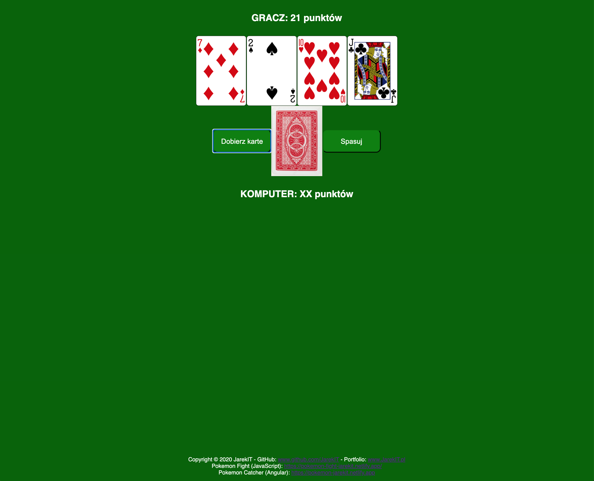
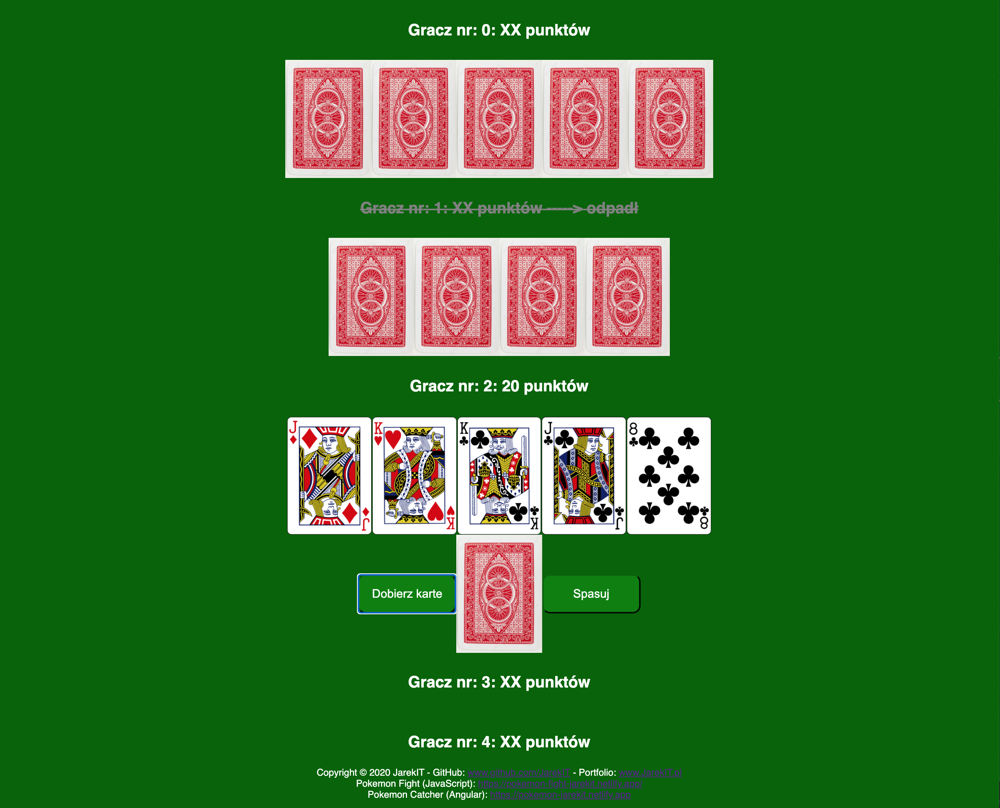

# 0CZK0

## Menu:
* [Game](#game)
* [Description](#description)
* [Preview](#preview)
* [Technologies](#technologies)
* [Instalation](#instalation)

## Game
https://oczko-jarekit.netlify.app - LIVE GAME

## Description
* The game is called "0CZKO0".
* The rules are simple: the player must get closer to the score of 21 points.
* Punctation:
Cards 2 through 10 have a value equal to that of the card |
Jack - 2 points |
Queen - 3 points |
King - 4 points |
Ace - 11 points
* The game uses 2 decks of 52 cards each.
* At the beginning of the game, you draw 2 cards.
* Then have two options to choose from: draw a card or fold.
* You can choose to play single or multiplayer.
* The game connects to [API] (http://deckofcardsapi.com/) to shuffle and draw cards.

## Preview
* Gameplay selection

* Gameplay mode: SOLO

* Gameplay mode: MULTIPLAYER

* Win/Lose message

## Technologies
* React

## Instalation

In the project directory, install npm packages:

### `npm install`

To start server:

### `npm start`

Runs the app in the development mode. 
Open [http://localhost:3000](http://localhost:3000) to view it in the browser.

The page will reload if you make edits. 
You will also see any lint errors in the console.
